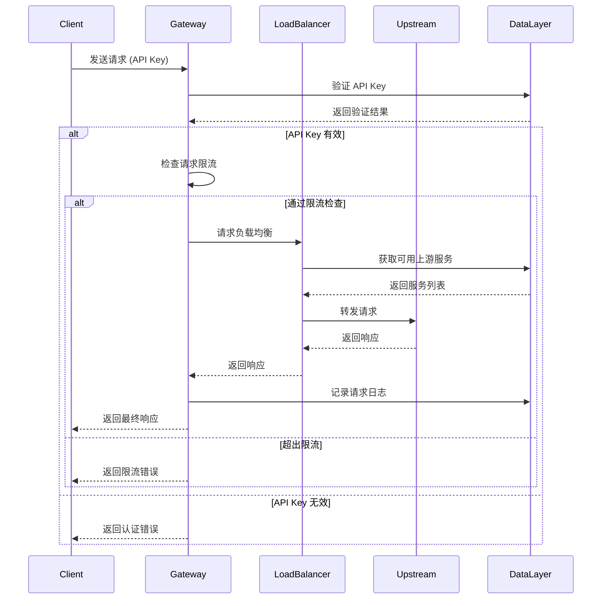
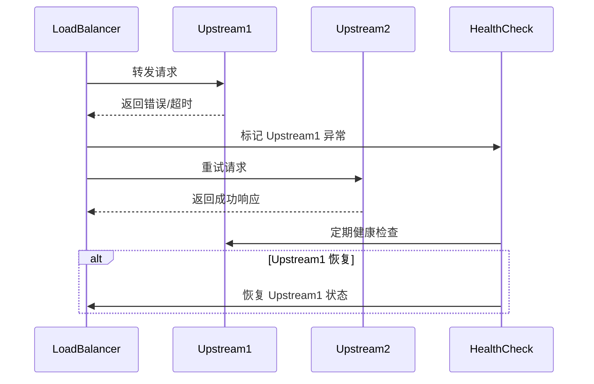

# 架构设计文档

## 概述

LLM Gateway 是一个智能网关系统，为 Claude Code 和 Gemini CLI 提供统一的代理服务。系统采用分层架构设计，确保高可用性、可扩展性和安全性。


## 系统架构

### 整体架构图

```
┌─────────────────────────────────────────────────────────────┐
│                        Client Layer                        │
├─────────────────┬─────────────────┬─────────────────────────┤
│   Web Dashboard │    CLI Tools    │      SDK/API Client     │
└─────────────────┴─────────────────┴─────────────────────────┘
                              │
┌─────────────────────────────▼─────────────────────────────────┐
│                     Gateway Layer                            │
├─────────────────┬─────────────────┬─────────────────────────┤
│  Authentication │  Load Balancer  │     Rate Limiting       │
├─────────────────┼─────────────────┼─────────────────────────┤
│   Request Log   │   Health Check  │     Error Handling      │
└─────────────────┴─────────────────┴─────────────────────────┘
                              │
┌─────────────────────────────▼─────────────────────────────────┐
│                    Upstream Pool                             │
├─────────────────┬─────────────────┬─────────────────────────┤
│   Claude Code   │   Gemini CLI    │    Account Manager      │
│    Accounts     │    Accounts     │                         │
└─────────────────┴─────────────────┴─────────────────────────┘
                              │
┌─────────────────────────────▼─────────────────────────────────┐
│                     Data Layer                               │
├─────────────────┬─────────────────┬─────────────────────────┤
│   User Pool     │    API Keys     │      Statistics         │
├─────────────────┼─────────────────┼─────────────────────────┤
│ Configuration   │      Logs       │      Monitoring         │
└─────────────────┴─────────────────┴─────────────────────────┘
```

## 核心组件

### 1. Gateway Layer (网关层)

#### Authentication Module (认证模块)
- **功能**: API Key 验证和用户身份认证
- **特性**: 
  - 支持多种认证方式
  - API Key 权限级别管理
  - 访问控制和权限验证

#### Load Balancer (负载均衡)
- **功能**: 智能请求分发和负载均衡
- **算法**: 
  - 轮询 (Round Robin)
  - 加权轮询 (Weighted Round Robin)
  - 最少连接 (Least Connections)
  - 响应时间优先 (Fastest Response)

#### Rate Limiting (限流控制)
- **功能**: 请求频率控制和流量管理
- **策略**:
  - 基于 API Key 的限流
  - 基于 IP 的限流
  - 滑动窗口算法
  - 令牌桶算法

### 2. Upstream Pool (上游服务池)

#### Account Manager (账号管理器)
- **功能**: 管理上游服务账号
- **特性**:
  - 账号状态监控
  - 自动故障检测
  - 账号轮换策略
  - 配额使用跟踪

#### Health Check (健康检查)
- **功能**: 监控上游服务可用性
- **机制**:
  - 定时健康检查
  - 故障自动切换
  - 恢复检测
  - 性能指标收集

### 3. Data Layer (数据层)

#### User Pool (用户池)
- **数据结构**:
```json
{
  "id": "string",
  "name": "string",
  "type": "claude-code|gemini-cli",
  "credentials": "encrypted",
  "status": "active|inactive|error",
  "quota": {
    "total": "number",
    "used": "number",
    "reset_time": "timestamp"
  },
  "last_health_check": "timestamp",
  "created_at": "timestamp",
  "updated_at": "timestamp"
}
```

#### API Keys
- **数据结构**:
```json
{
  "key_id": "string",
  "api_key": "hashed_string",
  "name": "string",
  "permissions": ["read", "write", "admin"],
  "rate_limit": {
    "requests_per_minute": "number",
    "requests_per_hour": "number"
  },
  "expires_at": "timestamp",
  "created_at": "timestamp",
  "last_used": "timestamp"
}
```

## 请求处理流程

### 标准请求流程



### 故障处理流程



## 安全设计

### 1. 认证安全
- API Key 采用 HMAC-SHA256 加密
- 支持 API Key 定期轮换
- 实现基于时间的 API Key 过期机制

### 2. 传输安全
- 强制使用 HTTPS 协议
- 支持双向 TLS 认证
- 请求和响应数据加密

### 3. 访问控制
- 基于角色的权限管理 (RBAC)
- IP 白名单和黑名单
- 请求来源验证

### 4. 数据安全
- 敏感数据加密存储
- 日志脱敏处理
- 定期安全审计

## 性能优化

### 1. 缓存策略
- API Key 验证结果缓存
- 上游服务状态缓存
- 请求结果缓存 (可选)

### 2. 连接池管理
- 上游服务连接池
- 数据库连接池
- 连接复用优化

### 3. 异步处理
- 非阻塞 I/O
- 异步日志记录
- 后台任务处理

## 监控和运维

### 1. 关键指标
- 请求处理时间 (P50, P95, P99)
- 请求成功率
- 上游服务可用性
- API Key 使用统计

### 2. 告警机制
- 服务异常告警
- 性能指标告警
- 配额使用告警
- 安全事件告警

### 3. 日志管理
- 结构化日志记录
- 日志等级管理
- 日志归档和清理
- 审计日志追踪

## 扩展性设计

### 1. 水平扩展
- 无状态服务设计
- 负载均衡支持
- 数据库分片
- 缓存集群

### 2. 插件化架构
- 认证插件接口
- 负载均衡算法插件
- 监控插件接口
- 自定义中间件

## 技术选型建议

### 后端框架
- **Node.js + Express/Fastify**: 高性能异步处理
- **Go + Gin/Echo**: 高并发、低延迟
- **Python + FastAPI**: 快速开发、丰富生态

### 数据存储
- **Redis**: 缓存和会话存储
- **PostgreSQL/MySQL**: 关系型数据存储
- **MongoDB**: 日志和统计数据存储

### 监控工具
- **Prometheus + Grafana**: 指标监控
- **ELK Stack**: 日志分析
- **Jaeger**: 分布式追踪

---

*文档版本: v1.0*  
*最后更新: 2025-07-31*