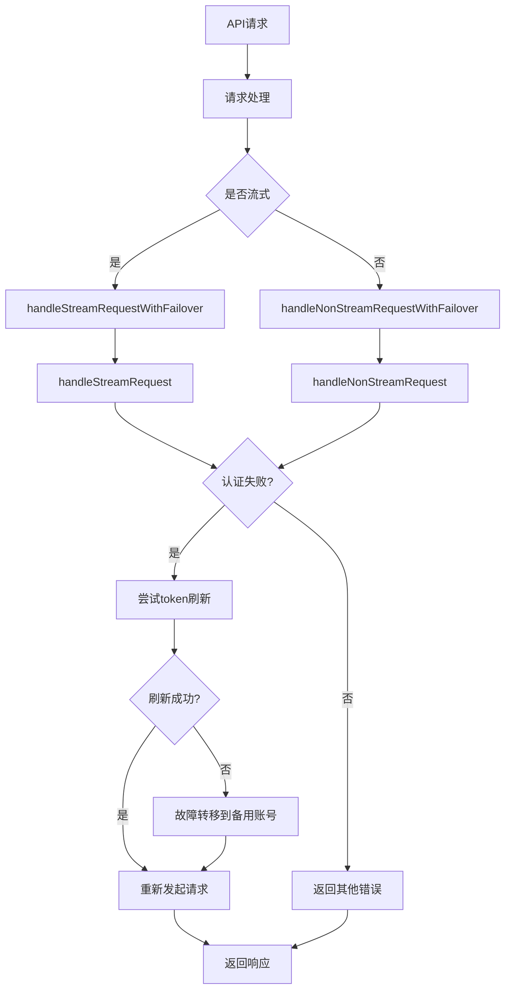

# OAuth Token管理系统改进总结

## 概述

本次改进主要针对LLM Gateway中的OAuth token过期问题，实现了完整的故障恢复和自动刷新机制。

## 已完成的改进

### 1. 故障转移机制实现 ✅

#### 流式请求故障转移
- 实现了 `handleStreamRequestWithFailover` 包装函数
- 在OAuth认证失败时优先尝试token刷新，失败后进行故障转移
- 支持递归重试，确保请求最终能够成功

#### 非流式请求故障转移  
- 创建了 `handleNonStreamRequestWithFailover` 函数
- 统一的错误解析和处理逻辑
- 智能区分需要故障转移的错误类型

### 2. 错误透传优化 ✅

#### 智能错误分类
- 实现了 `parseUpstreamError` 函数，准确识别错误类型
- 区分认证错误(401)、权限错误(403)、率限制(429)等
- 正确设置HTTP状态码和错误类型

#### 率限制错误处理
- 率限制错误(429)直接透传给客户端，不进行故障转移
- 保持错误信息的准确性，便于客户端处理

### 3. OAuth Token自动刷新机制 ✅

#### 核心组件
- **AnthropicOAuthClient**: 扩展了token刷新功能
  - `refreshAccessToken()`: 执行token刷新
  - `ensureValidToken()`: 智能检查和刷新
  - 支持ANTHROPIC_OAUTH和CLAUDE_CODE两种类型

- **OAuthTokenManager**: 统一的token管理服务
  - 定期检查所有OAuth账号的token状态(每30分钟)
  - 并行处理多个账号的token刷新
  - 自动更新数据库中的凭据信息

#### 应用启动集成
- 创建了 `startup.ts` 初始化脚本
- 在API路由中自动启动OAuth token刷新服务
- 优雅的进程退出处理

### 4. 管理和监控功能 ✅

#### OAuth管理API
- **GET** `/api/admin/oauth/refresh`: 查询所有OAuth账号状态
- **POST** `/api/admin/oauth/refresh`: 手动触发token刷新
  - 支持单个账号刷新: `{"action": "refresh-single", "accountId": "5"}`
  - 支持批量刷新: `{"action": "refresh-all"}`

#### 调试和测试工具
- 创建了token状态检查脚本 `tmp/test-oauth-refresh.js`
- 实时监控token过期时间和健康状态
- 详细的日志记录和错误追踪

## 技术实现要点

### 故障转移策略
1. **优先级机制**: OAuth认证失败时，优先尝试token刷新，失败后才进行账号故障转移
2. **防止递归**: 使用 `isFailoverAttempt` 参数避免无限递归
3. **资源安全**: 确保在故障转移过程中正确处理流资源和数据库连接

### 错误处理层次
1. **API层**: 统一的错误解析和状态码映射
2. **服务层**: 智能的故障转移和重试逻辑  
3. **数据层**: 正确的账号状态更新和健康检查

### 类型安全
- 完善了OAuth凭据的TypeScript类型定义
- 支持多种OAuth提供商的凭据格式
- 正确的Prisma枚举值使用

## 系统架构改进

## 监控和指标

### 关键指标
- **Token刷新成功率**: 监控自动刷新的成功率
- **故障转移频率**: 统计各账号的故障转移次数
- **请求成功率**: 整体请求成功率改善情况
- **响应时间**: 故障恢复对响应时间的影响

### 日志记录
- OAuth token过期检测和刷新过程
- 故障转移决策和执行日志
- 错误分类和处理结果
- 性能监控和统计信息

## 部署建议

### 环境配置
- 确保所有OAuth账号的refresh token有效
- 配置合适的健康检查间隔
- 设置监控告警规则

### 运维要点
- 定期检查OAuth账号的健康状态
- 监控token刷新失败的告警
- 备份重要的OAuth凭据信息

## 下一步改进建议

### 高优先级
1. **OAuth API格式调研**: 确定Claude AI token刷新API的正确格式
2. **健康检查优化**: 改进账号健康检查的准确性和频率
3. **监控告警**: 集成更完善的监控和告警系统

### 中优先级
1. **缓存优化**: 实现token状态的智能缓存机制
2. **负载均衡改进**: 基于账号健康状态的动态负载均衡
3. **API限流**: 实现更精细的API调用频率控制

### 低优先级
1. **多租户支持**: 支持不同用户的独立OAuth配置
2. **批量操作**: 批量账号管理和配置功能
3. **审计日志**: 完整的操作审计和合规日志

## 总结

通过本次改进，LLM Gateway现在具备了完整的OAuth token生命周期管理能力：

- ✅ **自动检测**: 定期检查token过期状态
- ✅ **智能刷新**: 自动尝试token刷新
- ✅ **故障恢复**: 刷新失败时自动故障转移
- ✅ **错误透传**: 正确处理各种类型的上游错误
- ✅ **监控管理**: 提供完善的管理和监控接口

这些改进显著提高了系统的可靠性和可用性，减少了因OAuth token过期导致的服务中断。